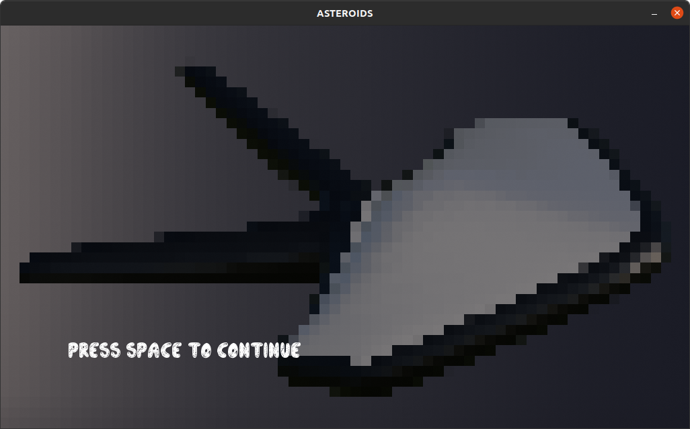
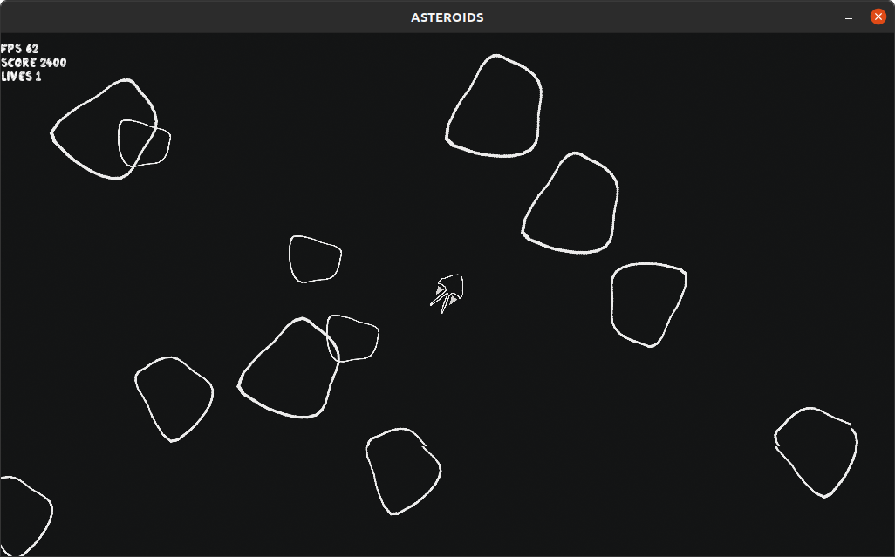
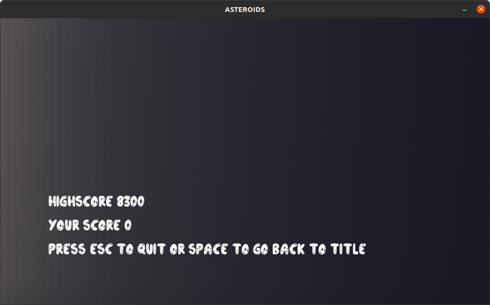

# NomeDaEngine
Uma das "game engines" mais ambiciosas do século 21, NomeDaEngine proporciona ferramentas avançadas para desenvolvimento de jogos 2D. Conta com gerenciamento de sprites e áudio, juntamente com o menor vazamento de memória desde 1972. Eleita melhor engine pela SBC (Sociedade "Brasileira?" de C) três anos consecutivos. (Projeto de IDJ - UnB - 2022/1)

## Compilar e Executar (Linux)
Para compilar, use `$ make`

Para executar, use `$ ./Run`

> É preciso ter _SDL 2.0_ instalada para executar o programa (veja esse [link](https://gist.github.com/aaangeletakis/3187339a99f7786c25075d4d9c80fad5))

## Asteroids
Jogo baseado na [versão de arcade](https://en.wikipedia.org/wiki/Asteroids_(video_game)) com mesmo nome (ápice da criatividade), feito usando a própria __NomeDaEngine__.

### Gameplay
O jogador controla uma nave com as teclas _w_, _a_, _s_, _d_ e atira com a tecla _space_.

O objetivo do jogo é destruir os asteroides e obter a maior quantidade de pontos possível. Cada asteroide destruído aumenta a pontuação em 100 pontos. Asteroides grandes se dividem em dois menores que, se destruídos, também valem 100 pontos cada um.

O jogo acaba quando o número de vidas do jogador atinge 0 (começa com 5 vidas). Na tela final são indicados a maior pontuação e a pontuação do jogador.

## Agradecimentos
Obrigado [Luiz](https://github.com/luizschonarth) pelo feedback e sugestões e a todos que chegaram até aqui!